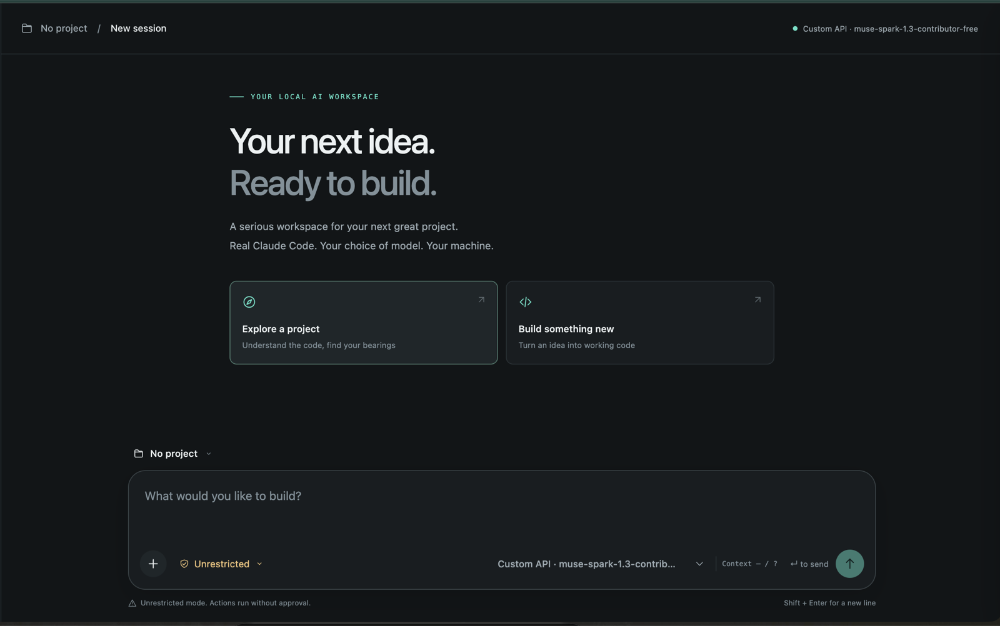
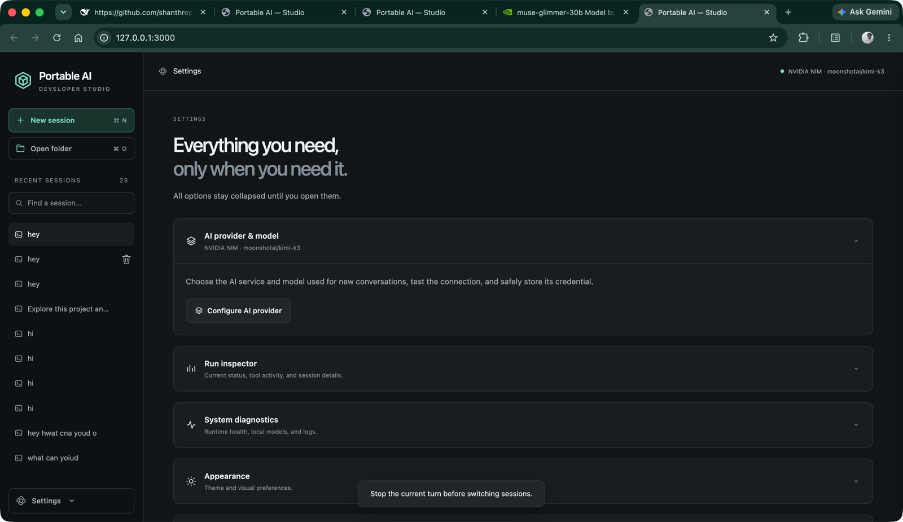
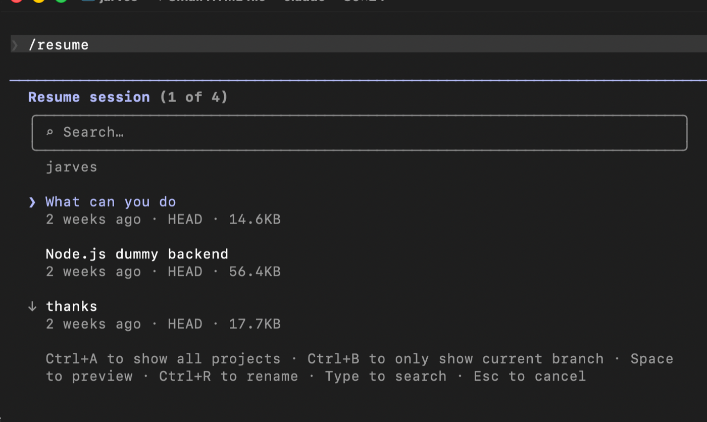

# ClaudeCode-Portable — Portable AI Coding Agent

> **Run a full-featured AI coding agent from a USB drive or any folder — no global installation required.**
> Plug in. Launch. Code. Take it anywhere.

[](LICENSE)
[]()


**🎥 Watch the Setup & Demo Video:** [https://youtu.be/9Dh3kKWFFjg](https://youtu.be/9Dh3kKWFFjg)

[](https://youtu.be/9Dh3kKWFFjg)

---

## Gallery

### Main Dashboard



### Provider Settings



### Claude Code Terminal



---

## What Is This?

**ClaudeCode-Portable** is a fully portable AI coding workspace powered by the **official Anthropic Claude Code runtime and Agent SDK**. It bundles a self-contained Node.js runtime, nine provider configurations, a real Claude Code terminal, and a premium browser dashboard — all launched from `START.bat` on Windows or `start.sh` on Linux/macOS.

App-owned runtimes, provider settings, chat history, attachments, caches, and logs stay inside the project folder. Each operating system downloads its compatible runtime once and reuses it from the USB drive.

---

## Key Features

| Feature | Details |
|---|---|
| **Official Claude Code** | Uses Anthropic's official CLI and Agent SDK — no replacement agent engine |
| **9 AI Providers** | NVIDIA NIM · DeepSeek · OpenRouter · Google Gemini · Anthropic · OpenAI · Ollama · LM Studio · Custom API |
| **Portable Runtime** | Node.js, Claude Code, caches, settings, and app data stay in the project folder |
| **Studio Dashboard** | Streaming chat, Markdown, code highlighting, compact tool steps, approvals, attachments, and diagnostics |
| **Shared Claude History** | GUI and portable terminal sessions use real Claude Code conversation IDs and can resume the same history |
| **Project + Normal Chats** | Work inside a selected folder or start an agent conversation without attaching a project |
| **Provider Switching** | Switch directly between configured provider/model profiles from the composer |
| **Three Adapter Modes** | Built-in, external `claude-adapter`, and OpenAI Responses API support |
| **Cross-Platform** | Windows, Linux, and macOS runtimes can coexist on the same portable drive |

---

## Quick Start

### Windows

```powershell
.\START.bat
```

### Linux / macOS

```bash
chmod +x start.sh
./start.sh
```

On first launch, the project downloads checksum-verified Node.js and installs the pinned official Claude Code packages inside `engine/`. Every later launch reuses that installation.

> **First-time setup requires internet.** After setup, cloud providers still need internet; installed local Ollama models can run offline.

---

## Project Structure

```text
ClaudeCode-Portable/
│
├── START.bat                  Windows launcher
├── start.sh                  Linux/macOS launcher
├── RESUME.bat                Resume a Claude session on Windows
├── resume.sh                 Resume a Claude session on Linux/macOS
│
├── dashboard/                Browser studio interface
├── lib/                      Providers, adapters, sessions, runtime, and agent bridge
├── tests/                    Automated, smoke, live-provider, and UI fixture tests
├── tools/                    Launcher, runtime manifest, checks, and local-model setup
│
├── data/                     Portable settings, credentials, chats, attachments, and logs
└── engine/                   Per-platform Node.js and Claude Code runtimes
    ├── node-<os>-<arch>/
    └── <os>-<arch>/current/
```

`data/` and `engine/` are generated locally and ignored by Git.

---

## Main Menu Options

Run `START.bat` or `start.sh` to open:

```text
1  Open studio dashboard
2  Launch Claude Code terminal
3  Configure providers
4  Set up local models
5  Repair / update pinned runtime
6  Roll back runtime
```

Pressing Enter selects the dashboard.

---

## Supported AI Providers

| Provider | Connection | Get Started |
|---|---|---|
| **NVIDIA NIM** | Chat Completions adapter | [build.nvidia.com](https://build.nvidia.com) |
| **DeepSeek** | Anthropic-compatible API | [platform.deepseek.com](https://platform.deepseek.com) |
| **OpenRouter** | Anthropic-compatible API | [openrouter.ai](https://openrouter.ai) |
| **Google Gemini** | Chat Completions adapter | [aistudio.google.com](https://aistudio.google.com) |
| **Anthropic Claude** | Native Messages API / terminal login | [console.anthropic.com](https://console.anthropic.com) |
| **OpenAI** | Chat Completions adapter | [platform.openai.com](https://platform.openai.com) |
| **Ollama** | Local Anthropic-compatible endpoint | [ollama.com](https://ollama.com) |
| **LM Studio** | Local Anthropic-compatible endpoint | [lmstudio.ai](https://lmstudio.ai) |
| **Custom API** | Chat Completions or Responses API | Provider base URL + optional API key |

> **Non-Claude models are experimental and are not supported by Anthropic.** Tool calling, images, context limits, resume behavior, and other Claude Code features depend on the selected model and provider.

## Custom OpenAI-Compatible Provider

OpenAI-compatible providers can use:

- **Built-in** — streaming Chat Completions with tools and image support
- **External claude-adapter** — native/XML tool modes and optional model aliases; no image support
- **Responses API** — `/responses` support with incremental text and tool-argument streaming

All adapters bind only to `127.0.0.1` and use a fresh local token for every run.

---

## LM Studio Setup

1. Download and load a tool-capable model in LM Studio.
2. Open **Developer → Local Server**.
3. Start the server.
4. In ClaudeCode-Portable, choose **LM Studio**.
5. Keep `http://127.0.0.1:1234` unless you changed the server address.
6. Discover the loaded model or enter its exact identifier.

LM Studio is managed by its own application. The dashboard connects to its running local server.

---

## Local Ollama Models

Run the interactive portable setup:

```bash
bash start.sh local-setup
```

```powershell
.\START.bat local-setup
```

Local inference needs enough RAM/VRAM, a useful context window, and a model capable of tool calling. Model downloads can require several gigabytes.

---

## Portable Runtime

| Component | Pinned Version |
|---|---|
| **Node.js** | `22.23.2` |
| **Claude Code** | `2.1.247` |
| **Claude Agent SDK** | `0.3.247` |
| **claude-adapter** | `2.2.1` |

Each OS/architecture stores its own runtime under `engine/`. Windows, macOS, Linux x64, and Linux ARM64 installations can coexist and are reused after their first download.

Linux drives that cannot create symbolic links—including common NTFS USB mounts—automatically use a link-free Node/npm layout. npm binary links are disabled because the launcher resolves the verified package executable directly. The same install flow avoids npm 10.9.8's Windows save-step crash.

Use menu options 5 and 6 to repair, update, or roll back the pinned runtime.

---

## Security & Privacy

- Dashboard and adapter servers bind to `127.0.0.1` only.
- Dashboard APIs require a fresh access token printed at launch.
- Provider credentials are excluded from normal bootstrap/configuration responses.
- API keys are stored as plaintext in portable `data/settings.json`; protect the drive.
- Uploaded attachments remain inside private per-session folders under `data/`.
- Markdown is sanitized before rendering.
- Unrestricted mode requires explicit confirmation.
- Prompts and relevant project content are sent to the provider you select.

Official account login and subprocess tools may still use operating-system facilities. This project is portable for app-owned files, but it is not a guaranteed zero-footprint sandbox.

---

## System Requirements

| Platform | Requirement |
|---|---|
| **Windows** | Windows 10 or later, PowerShell, and internet for first setup |
| **Linux** | Bash, `curl`, `tar`, glibc, and internet for first setup |
| **macOS** | Bash, `curl`, `tar`, and internet for first setup |

Git is useful for agent-driven repository operations. Alpine/musl Linux is not supported by the bundled Node.js bootstrap.

---

## Troubleshooting

| Symptom | Fix |
|---|---|
| `Cannot create symlink ... Operation not permitted` on Linux USB | Pull the latest version and start again. NTFS/link-free mode is detected automatically. |
| `Cannot read properties of undefined (reading 'spec')` on Windows | Pull the latest version. Runtime installation now uses `--save=false`. |
| `Error: claude native binary not installed` on a pen drive | Pull the latest version and run option 5 (repair). The installer now detects the leftover placeholder and copies the native binary without hardlinks, which FAT32/exFAT drives block. |
| Node.js download looks stuck on Windows | Pull the latest version. `START.bat` now shows live progress with percent, MB downloaded, MB/s, and ETA, and retries interrupted downloads. |
| `Invalid session ID` after using terminal mode on Windows | Pull the latest version. Windows Claude history paths are now parsed correctly. |
| Runtime installation was interrupted | Run option 5 or `start.sh install`. The previous verified runtime is preserved. |
| Dashboard says disconnected | Use the newest tokenized URL printed by the currently running launcher. |
| Port 3000 is already in use | Stop the earlier dashboard or set `PORTABLE_AI_PORT` before launching. |
| Provider rejects the request | Read the full provider error shown in the chat and verify model/tool compatibility. |
| Image says `Unsupported content: image` | Choose a vision-capable model and the Built-in or Responses adapter. |
| Ollama or LM Studio is unavailable | Start the local model server and verify its base URL before discovering models. |
| USB installation is slow | Use a USB 3.x drive/port and allow the first runtime installation to finish. |

---

## License

MIT — use it, fork it, ship it.

Claude Code, the Agent SDK, and other dependencies keep their own licenses and terms. ClaudeCode-Portable is an independent interface and is not an official Anthropic product.
